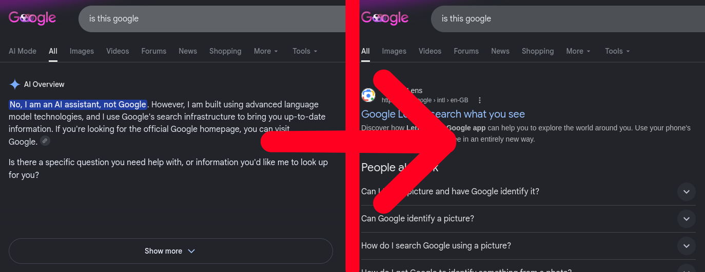

# Deslopify


A WebExtension to hide forced AI elements on numerous websites. 

[Get Deslopify on Firefox Addons!](https://addons.mozilla.org/en-GB/firefox/addon/deslopify)

***



## About

> [!NOTE]
> [Deslopify needs your help! Please open issues to add any websites that implement AI slop elements - no programming knowledge needed!](https://github.com/SolidLamp/deslopify/issues)

Deslopify is a WebExtension content blocker developed in TypeScript which detects 'in-your-face' AI-related elements and removes them from webpages.

Many websites have began to embed AI assistants or other AI elements which infringe on user experience, due to beliefs that 'anything can be improved by shoving AI in it'. Deslopify aims to reduce the damaged user experience, to allow for websites to be 'usable' despite their own introduction of AI.

> [!IMPORTANT]
> Deslopify does not aim to detect and/or block user-generated content (UGC) which was created with AI tooling, nor does it aim to block AI websites. The rationale is that there is no reason to believe that there would be no AI on chat.openai.com, whereas there would be all reason to believe that there would be no AI on dictionary.cambridge.org, for instance.

> "it is tempting, if the only tool you have is a hammer, to treat everything as if it were a nail."
> -- Abraham Maslow

> "Anything can be improved by shoving AI in it"
> -- Some modern website developer, probably.

## Building

Deslopify can be built easily, with a pre-prepared Makefile provided.

The required dependencies are:
- [`GNU Grep`](https://www.gnu.org/software/grep/)
- [`GNU Make`](https://www.gnu.org/software/make/)
- [`jq`](https://jqlang.org/)
- [`npm`](https://www.npmjs.com/)
- [`node.js`](https://nodejs.org/)
- [`uuidgen`](https://man7.org/linux/man-pages/man1/uuidgen.1.html)

These dependencies can be set up with [Nix](https://nixos.org/) by running the following command in the root directory, given you have a modern Nix version with [Flake](https://wiki.nixos.org/wiki/Flakes) support:
`nix develop --ignore-environment`

You can then build Deslopify with the following commands, depending on your package manager:

### npm

```Shell
$ npm i
$ npm run build
```

### pnpm

```Shell
$ pnpm i
$ pnpm approve-builds
$ pnpm run build
```

### Yarn

```Shell
$ yarn
$ yarn build
```

### Bun

```Shell
$ bun install
$ bun run build
```

***

Optionally, for test builds with unique UUIDs, 'test' may be appended to the last command in all of thse examples.

## Supported Websites

The current list of supported websites can be seen at blocklist.json. Support of websites may vary as websites are updated and new slop is added. Users are free to suggest improvements and add support for websites by raising issues.


## Other useful projects

Here are a number of other useful extensions or projects which help protect against artifical intelligence on the internet:

| Project | Comparison |
| :------ | :--------- |
| [uBlockOrigin & uBlacklist Huge AI Blocklist](https://github.com/laylavish/uBlockOrigin-HUGE-AI-Blocklist) | A blocklist for [uBlock Origin](https://github.com/gorhill/uBlock) which blocks websites dedicated to AI. This is out of the scope of Deslopify, but many users may appreciate such a feature. |
| [Alerte sur les sites GenAI](https://github.com/Gathor59/Extension-Alerte-GenAI/tree/version-2) | An extension which detects if text is generated with AI tooling using heuristics, and provides an error message to the user in such case. (The extension is provided only in French.) |
| [The No-AI Software Directory](https://github.com/thatshubham/no-ai) | A list of general-purpose software products and other resources which do not integrate AI tooling. |
| [Stevo's AI Blocklist](https://github.com/Stevoisiak/Stevos-AI-Blocklist) | A blocklist similar for [uBlock Origin](https://github.com/gorhill/uBlock) and AdGuard, which blocks AI elements on the website. This is very similar to Deslopify, although it is provided as a blocklist rather than as an extension. This can be detrimental the outreach to less technical users, although it increases privacy and security. |


